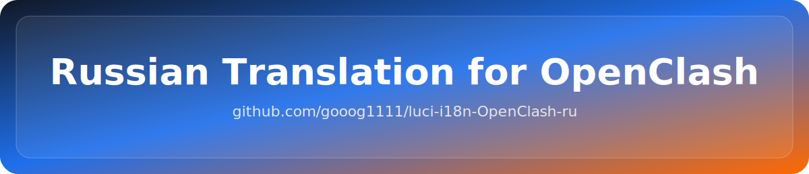
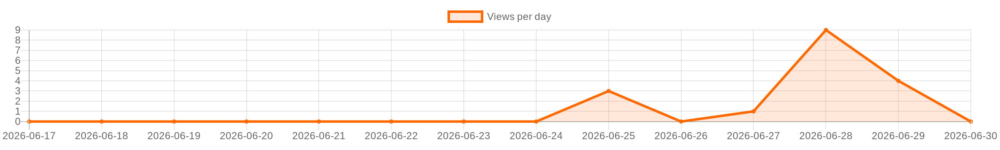

<!-- LANG_START -->
🇷🇺 [Русская версия](README.md)
<!-- LANG_END -->

<div align="center">



</div>


<!-- STATS_START -->
<!-- auto-updated by GitHub Actions · 2026-07-06 07:01 UTC -->

[](https://github.com/gooog1111/luci-i18n-OpenClash-ru)
[](https://github.com/gooog1111/luci-i18n-OpenClash-ru)
[](https://github.com/gooog1111/luci-i18n-OpenClash-ru)
[](https://github.com/gooog1111/luci-i18n-OpenClash-ru)
[](https://github.com/gooog1111/luci-i18n-OpenClash-ru/stargazers)
[](https://github.com/gooog1111/luci-i18n-OpenClash-ru/network/members)
[](https://github.com/gooog1111/luci-i18n-OpenClash-ru/releases/latest)
[](https://github.com/gooog1111/luci-i18n-OpenClash-ru/releases)

<!-- STATS_END -->


<!-- GRAPH_START -->
<p align="center">
  
</p>
<!-- GRAPH_END -->


<!-- ISSUES_START -->
<!-- auto-updated by GitHub Actions · 2026-07-06 07:01 UTC -->

## Issues

<p>
  <a href="https://github.com/gooog1111/luci-i18n-OpenClash-ru/issues">
    
  </a>
  
</p>

<details open>
<summary><b>Open issues</b></summary>


<p align="center">
  <b>Issues are disabled in this repository.</b>
</p>


</details>

<p>
  <a href="https://github.com/gooog1111/luci-i18n-OpenClash-ru/issues">All issues</a>
</p>

<!-- ISSUES_END -->


## Russian Translation for OpenClash

## 📝 Description

Russian localization for the OpenClash interface - the Clash client for OpenWrt. This package provides a complete translation of the OpenClash management interface into Russian.

> ⚠️ **Note**: The translation was made using artificial intelligence and may contain inaccuracies. We would appreciate your corrections and suggestions!

## ✨ Features

- 🎯 **Full translation** - all interface elements are translated into Russian
- 🔧 **Technical accuracy** - all technical terms and service names are saved
- 📱 **Adaptive design** - correct display on all devices
- ⚡ **Light weight** - minimal impact on performance

## 📦 Installation

## # Manual installation

2. Install the package:
```bash
wget -O /usr/lib/lua/luci/i18n/openclash.ru.lmo "https://github.com/gooog1111/luci-i18n-openclash-ru/releases/latest/download/openclash.ru.lmo"
```

## 🔧 Language settings

After installation:

1. Go to **System → Language and Style**
2. Select **Russian** from the drop-down list
3. Click **Save and Apply**

Or install the language via the command line:
```bash
uci set luci.main.lang=ru
uci commit luci
```

## 🐛 Error messages

If you find errors in the translation or have suggestions for improvement:

1. Create an Issue in this repository
2. Or suggest edits via Pull Request

## 🤝 Project support

If this translation was useful to you, please give the repository a ⭐ star!

[__PROTECTED_11__](https://github.com/gooog1111/luci-i18n-OpenClash-ru.git)

## 📄 License

This project is distributed under the same license as the original OpenClash.

## 🔗 Links

- [Официальный репозиторий OpenClash](https://github.com/vernesong/OpenClash)
- [Документация OpenClash](https://github.com/vernesong/OpenClash/wiki)

## Support the project

Choose a convenient method:

<p align="center">
  <a href="https://yoomoney.ru/fundraise/1IJBVM8MJMG.260624" target="_blank">
    
  </a>
  <a href="https://t.tb.ru/c2c-qr-choose-bank?requisiteNumber=+79996363556&bankCode=100000000004" target="_blank">
    
  </a>
</p>

## # USDT/USDC/GRAM (TON)

Address for transfer:  
```bash
UQA73kPkNHudFD5yV7DuP-GuXO1ExTpqH0gNioQX8sY4fU6L
```
## # BTC (Bitcoin)

Address for transfer:  
```bash
bc1q6ny6adsgp0s5ngsng4adclqq9d6hyvqw625g8f
```
## # ETH (Etherium)

Address for transfer:  
```bash
bc1q6ny6adsgp0s5ngsng4adclqq9d6hyvqw625g8f
```
